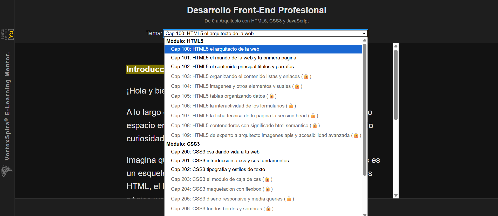
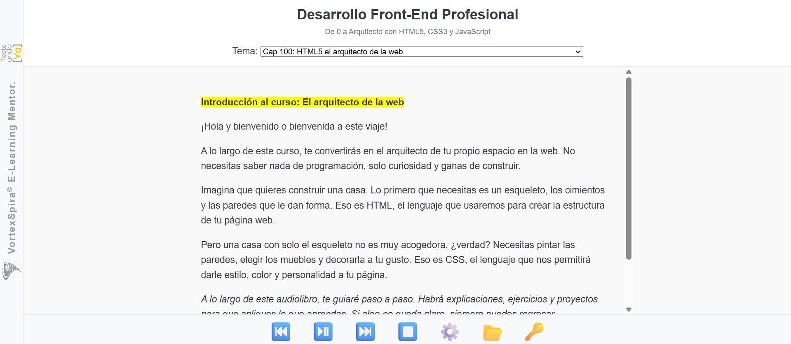
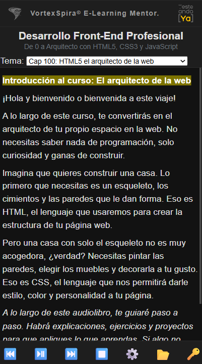
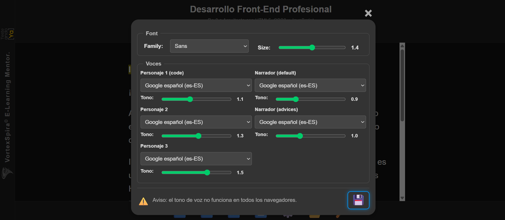
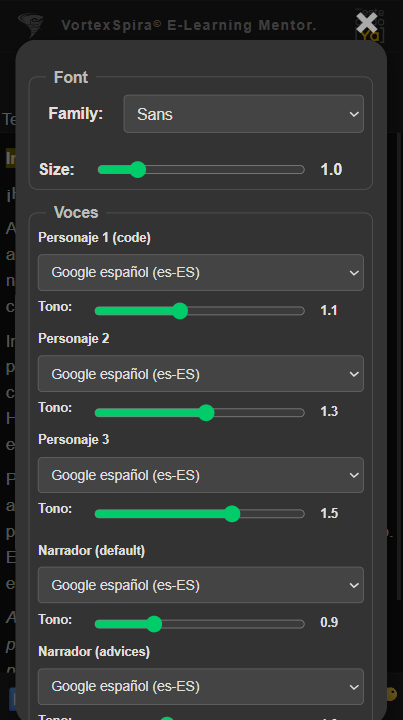
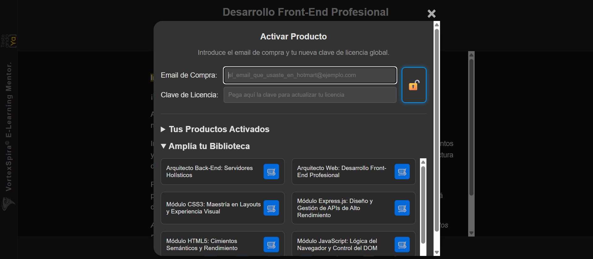
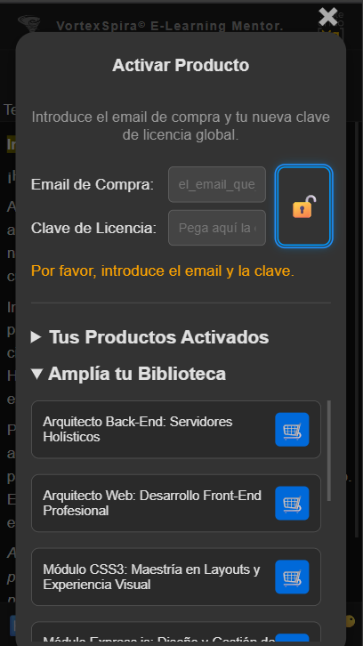

***

# **🌪️ VortexSpira®: Tu Mentor de Audio-Aprendizaje para la Arquitectura Web y QA**

*Transformamos tu carrera con una **experiencia de inmersión sensorial hands-free**, eliminando la fricción del vídeo para que te centres en la práctica y la transformación técnica.*

***

## **🚀 ¡Únete a la Lista de Fundadores!**

**Sé el primero en acceder a VortexSpira® y asegura tu descuento de lanzamiento de más del 60%.** Descubre la plataforma de e-learning diseñada por ingenieros, para ingenieros, que elimina la ansiedad de aprender.

> **[➡️ Sí, quiero mi acceso prioritario y descuento exclusivo](https://subscribepage.io/vortexspira)**

***

### **🎁 Freemium por Defecto: Prueba Antes de Comprar**

VortexSpira® no es un producto que compras a ciegas. Cuando esté disponible, la plataforma se instalará como una PWA (Aplicación Web Progresiva) en tu sistema. Por defecto, tendrás acceso **gratuito y permanente** a los **dos primeros capítulos de cada módulo, de cada curso.**

Podrás explorar la interfaz, probar la metodología y aprender los fundamentos sin coste alguno. Cuando estés listo para convertirte en un Arquitecto, podrás adquirir la licencia para desbloquear todo el contenido (marcado con 🔒) directamente desde la plataforma.

  

***

## 📸 Un Vistazo a la Plataforma (Desktop vs. Mobile)

Diseñada desde cero para ser 100% responsive. Una experiencia sin fisuras, ya sea en tu escritorio o en tu móvil.

| Característica Clave | Vista de Escritorio (Desktop) | Vista Móvil (Mobile) |
| :--- | :---: | :---: |
| **Aprendizaje Inmersivo**   La misma experiencia de audio-aprendizaje sincronizado en cualquier pantalla. |  |  |
| **Control Total**   Tu "joya de la corona": la personalización de voces, tono y fuentes, totalmente accesible en móvil. |  |  |
| **Ecosistema y Licencias**   Activa tus productos y amplía tu biblioteca desde cualquier dispositivo. |  |  |

***

## ✨ **Ingeniería de la Experiencia (UX) y Accesibilidad Total**

El valor de VortexSpira reside en su diseño técnico, optimizado para la eficiencia y la continuidad del aprendizaje:

### 🧠 **Zero Fricción y Guía Contextual**

* **Sincronización Total (Highlight & Voz):** La plataforma ofrece una sincronización perfecta entre el resaltado visual de la frase y la voz del mentor.
* **Selección de Voces por Rol:** Configura y personaliza la voz y el **tono** para cada rol (Narrador, Lector de Código, Consejos), mejorando la diferenciación auditiva.
* **Navegación *Hands-Free*:** Controla la reproducción (Parar, Siguiente/Anterior Frase) desde el **teclado multimedia** o la **ventana minimizada**.
* **Guía Visual Contextual (Modo Desktop - En Desarrollo):** Un modal de visualizaciones mostrará una **captura de pantalla sincronizada** con el *highlight* para guiar al alumno en las implicaciones del código en el navegador o en la localización de menús de herramientas.

### 🔗 **Continuidad y Portabilidad (Multidispositivo)**

* **Diseño 100% Responsive:** La interfaz está diseñada para adaptarse perfectamente a cualquier tamaño de pantalla, desde móviles y tabletas hasta ordenadores de escritorio.
* **Aprendizaje Offline Híbrido:** Inicia sesión y carga tu módulo una vez, y luego consume **todo el contenido del módulo sin conexión** a internet. Perfecto para viajar o zonas de baja cobertura. La conexión solo es necesaria para validar tu licencia, cambiar de módulo o sincronizar tu progreso.
* **Sincronización Automática (En Desarrollo):** Podrás pausar una lección en un dispositivo y continuar **exactamente en la misma frase** en otro, garantizando la continuidad de la sesión.
* **Compatibilidad Total:** La interfaz es completamente accesible y navegable con el **teclado** y compatible con **lectores de pantallas** (ARIA).
* **Control de Playback:** Haz clic en **cualquier frase de la pantalla** para saltar instantáneamente a ese punto y reanudar la narración.

### 🎨 **Diseño Coherente y Control de la Interfaz (UI)**

* **Temas Inteligentes:** Soporte completo para el **Modo Oscuro** en todos los elementos (contenido y *modales*).
* **Personalización:** Ajusta y guarda la **familia** y el **tamaño de la fuente** a tu gusto.
* **Modales Estables:** Los menús de configuración y activación tienen un **tamaño máximo fijo** que previene "saltos" en el diseño (`CLS`).
* **Botones Visibles y Profesionales:** Controles clave como Guardar (💾) y Activar (🔓) utilizan un diseño minimalista ("Ghost Button") que se **ilumina en el borde** al interactuar.

### 🛠️ **Flujo de Licencias, Certificación y Catálogo**

* **Gestión Centralizada:** El modal de activación te permite **actualizar tu clave global** en cualquier momento.
* **🛒 Catálogo Inteligente:** Muestra un **catálogo de productos adquiridos** y **módulos disponibles para la compra**, con altura limitada y scroll.
* **🎓 Validación de Conocimientos (En Desarrollo):** Cada producto adquirido en tu catálogo incluirá un **enlace directo (🏆) al examen de certificación** correspondiente en Hotmart, donde obtendrás tu certificado de conocimientos, verificable con QR.
* **✍️ Exámenes de Nivel Profesional:** Los exámenes son tipo test (formato ISTQB), donde cada pregunta puede tener múltiples respuestas correctas y **debes marcarlas todas** para acertar. Se requiere un 70% para aprobar.
* **🔒 Acceso Visual:** Los capítulos se desbloquean en tiempo real en el selector, reemplazando el candado (visible si no se ha adquirido el módulo).

***

### **🎯 Conviértete en Arquitecto o QA Holístico: Tu Dominio Técnico Comienza Aquí.**

---

## Licencia y Derechos de Uso

La plataforma **VortexSpira®** es un software comercial propietario.

* **Copyright © 2025 Diego González Fernández.** Todos los derechos reservados.
* El uso de la plataforma VortexSpira® requiere la adquisición de una **licencia válida** a través de los canales de venta autorizados (Hotmart).
* La distribución, modificación o ingeniería inversa del software están estrictamente prohibidas sin acuerdo previo por escrito con el autor.
* La marca VortexSpira® está registrada o en proceso de registro.
* La creación intelectual de la plataforma está registrada en **Safe Creative** ([**🛡️ Registro de Derechos**](https://www.safecreative.org)).

El **contenido de los cursos** que se ejecutan en esta plataforma se licencia por separado bajo sus propios términos al adquirir cada producto.

---

© 2025 Diego González Fernández
[LinkedIn](https://www.linkedin.com/in/diego-gonzalez-fernandez)
