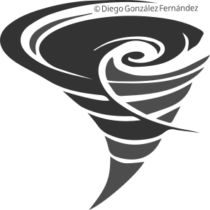
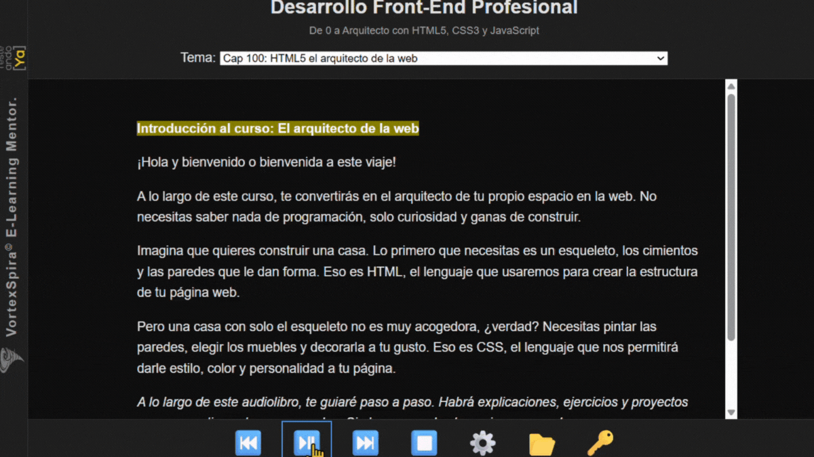
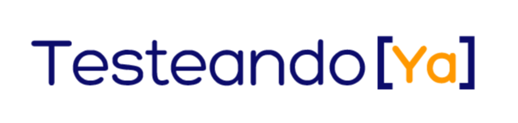
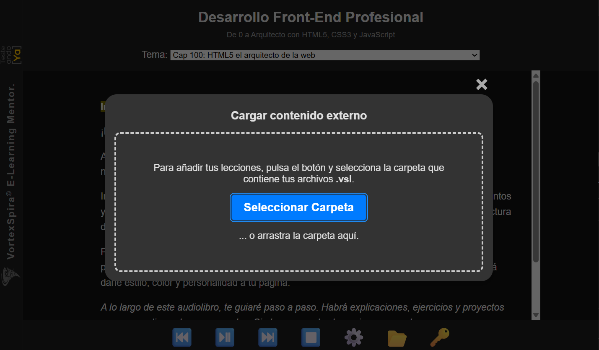

#  **VortexSpira®: Tu Mentor de Audio-Aprendizaje para la Arquitectura Web y QA**

*Transformamos tu carrera con una **experiencia de inmersión sensorial hands-free**, eliminando la fricción del vídeo para que te centres en la práctica y la transformación técnica.*

***

## **🚀 ¡Únete a la Lista de Fundadores! (Pre-Lanzamiento)**

La plataforma se lanzará a principios de 2026. **Sé el primero en acceder y asegura tu descuento de lanzamiento de más del 60%.** Descubre la plataforma de e-learning diseñada por ingenieros, para ingenieros, que elimina la ansiedad de aprender.

> **[➡️ Sí, quiero mi acceso prioritario y descuento exclusivo](https://subscribepage.io/vortexspira)**

***

[Vistazo](#vistazo) • [Diseño Cognitivo](#diseno-cognitivo) • [Características](#caracteristicas) • [El Arquitecto](#arquitecto) • [Alianza](#alianza) • [Freemium](#freemium) • [Para Educadores](#educadores) • [Licencia](#licencia)

***

## 📸 Un Vistazo a la Plataforma (Desktop vs. Mobile)

Diseñada desde cero para ser 100% responsive. Una experiencia sin fisuras, ya sea en tu escritorio o en tu móvil.

| Característica Clave | Vista de Escritorio (Desktop) | Vista Móvil (Mobile) |
| :--- | :---: | :---: |
| **Aprendizaje Inmersivo**   La misma experiencia de audio-aprendizaje sincronizado en cualquier pantalla. |  |  |
| **Control Total**   Tu "joya de la corona": la personalización de voces, tono y fuentes, totalmente accesible en móvil. |  |  |
| **Ecosistema y Licencias**   Activa tus productos y amplía tu biblioteca desde cualquier dispositivo. |  |  |

[Volver al índice ▲](#indice)

***

## 🧠 Diseño Basado en la Ciencia Cognitiva: Combatiendo la Fatiga

La ingeniería de VortexSpira® no es solo técnica, es empática. La plataforma está diseñada siguiendo las **mejores prácticas para la accesibilidad cognitiva**, pensando específicamente en usuarios con **fatiga cognitiva** (como la causada por la Esclerosis Múltiple) o **divergencias de atención** (como el TDAH).

**La clave es el Foco Guiado (Audio + Highlight).** La sincronización perfecta de la voz del mentor con el texto resaltado reduce drásticamente la carga cognitiva. El cerebro no tiene que gastar energía en "mantener la posición" en un muro de texto; es guiado de forma natural, permitiendo que toda la atención se centre en la **comprensión**, no en la navegación.

  
   
  <em>Nota: El modal de imágenes sincronizadas está en desarrollo. El texto mostrado pertenece a una versión beta del curso 'Arquitecto Web' y no representa el contenido final.</em>

 

Además, la **Separación de Estímulos (Texto vs. Imágenes)** evita la sobrecarga sensorial. Al presentar las imágenes de forma contextual (en un modal o en una esquina) y separadas del flujo principal de texto, el usuario procesa un tipo de información a la vez, una técnica fundamental para mantener la concentración y prevenir el agotamiento.

[Volver al índice ▲](#indice)

***

## ✨ **Ingeniería de la Experiencia (UX) y Accesibilidad Total**

El valor de VortexSpira reside en su diseño técnico, optimizado para la eficiencia y la continuidad del aprendizaje:

### 🧠 **Zero Fricción y Guía Contextual**

* **Sincronización Total (Highlight & Voz):** La plataforma ofrece una sincronización perfecta entre el resaltado visual de la frase y la voz del mentor.
* **Selección de Voces por Rol:** Configura y personaliza la voz y el **tono** para cada rol (Narrador, Lector de Código, Consejos), mejorando la diferenciación auditiva.
* **Dictado Amigable (Visual vs. Audio):** El núcleo del formato `.vsl` es la capacidad de **desacoplar el texto que se muestra del texto que se lee**. Esto permite que el "Lector de Código" narre el código de forma natural (ej: "creamos la constante equis") mientras el usuario ve el código literal (ej: `const x = 1;`), eliminando la principal fuente de fricción del audio-aprendizaje técnico.
* **Navegación *Hands-Free*:** Controla la reproducción (Reproducir/Parar, Siguiente/Anterior Frase, Reiniciar capítulo) desde el **teclado multimedia** con la **ventana minimizada**.
* **Guía Visual Contextual (Modo Desktop - En Desarrollo):** Un modal de visualizaciones mostrará una **captura de pantalla sincronizada** con el *highlight* para guiar al alumno en las implicaciones del código en el navegador o en la localización de menús de herramientas.

### 🗣️ **Voces Inteligentes y Adaptables**

VortexSpira® utiliza las voces Text-to-Speech (TTS) disponibles en tu navegador y sistema operativo. Prioriza automáticamente las de mayor calidad (como Google si estás online) y conmuta a las voces locales si pierdes la conexión, garantizando un aprendizaje ininterrumpido. La variedad y calidad dependen de tu navegador (Chrome/Edge suelen ser los mejores) y de los **paquetes de idioma instalados en tu sistema operativo**. Para más opciones, simplemente instala los paquetes de voz completos desde la configuración de idioma de tu Windows, macOS o Linux.

### 🔗 **Continuidad y Portabilidad (Multidispositivo)**

* **Diseño 100% Responsive:** La interfaz está diseñada para adaptarse perfectamente a cualquier tamaño de pantalla, desde móviles y tabletas hasta ordenadores de escritorio.
* **Aprendizaje Offline Híbrido:** Inicia sesión y carga tu módulo una vez, y luego consume **todo el contenido del módulo sin conexión** a internet. Perfecto para viajar o zonas de baja cobertura. La conexión solo es necesaria para validar tu licencia, cambiar de módulo o sincronizar tu progreso.
* **Sincronización Automática (En Desarrollo):** Podrás pausar una lección en un dispositivo y continuar **exactamente en la misma frase** en otro, garantizando la continuidad de la sesión.
* **Compatibilidad Total:** La interfaz es completamente accesible y navegable con el **teclado** y compatible con **lectores de pantallas** (ARIA).
* **Control de Playback:** Haz clic en **cualquier frase de la pantalla** para saltar instantáneamente a ese punto y reanudar la narración.

### 🎨 **Diseño Coherente y Control de la Interfaz (UI)**

* **Temas Inteligentes:** Soporte completo para el **Modo Oscuro** en todos los elementos (contenido y *modales*).
* **Personalización:** Ajusta y guarda la **familia** y el **tamaño de la fuente** a tu gusto.
* **Modales Estables:** Los menús de configuración y activación tienen un **tamaño máximo fijo** que previene "saltos" en el diseño (`CLS`).
* **Botones Visibles y Profesionales:** Controles clave como Guardar (💾) y Activar (🔓) utilizan un diseño minimalista ("Ghost Button") que se **ilumina en el borde** al interactuar.

### 🛠️ **Flujo de Licencias, Certificación y Catálogo**

* **Gestión Centralizada:** El modal de activación te permite **actualizar tu clave global** en cualquier momento.
* **🛒 Catálogo Inteligente:** Muestra un **catálogo de productos adquiridos** y **módulos disponibles para la compra**, con altura limitada y scroll.
* **🎓 Validación de Conocimientos (En Desarrollo):** Cada producto adquirido en tu catálogo incluirá un **enlace directo (🏆) al examen de certificación** correspondiente en Hotmart, donde obtendrás tu certificado de conocimientos, verificable con QR.
* **✍️ Exámenes de Nivel Profesional:** Los exámenes son tipo test (formato ISTQB), donde cada pregunta puede tener múltiples respuestas correctas y **debes marcarlas todas** para acertar. Se requiere un 70% para aprobar.
* **🔒 Acceso Visual:** Los capítulos se desbloquean en tiempo real en el selector, reemplazando el candado (visible si no se ha adquirido el módulo).

[Volver al índice ▲](#indice)

***

## 👤 Del Arquitecto: Una Plataforma Nacida de la Experiencia

VortexSpira® es una plataforma creada y diseñada por **Diego González Fernández, Ingeniero de Calidad Integral**. Nació de una necesidad personal: buscaba crear un **audiolibro multilenguaje** para aprender idiomas de forma inmersiva, pero también una herramienta que se adaptara a mi "hardware" mental (pensamiento no lineal y memoria asociativa) y a mi "software" (pensamiento lateral).

Esta arquitectura personal es la que condiciona mi forma de explicar y enseñar, buscando siempre el "porqué" y el "sistema" debajo de la "palabrería".

Mi filosofía de 'QA Holístico' se aplica a cada detalle, desde la arquitectura 'inexpugnable' de la plataforma hasta el contenido que enseña el 'porqué' antes que el 'cómo'. Mi objetivo no es enseñarte a escribir código, es enseñarte a pensar como un arquitecto.

### 🏗️ Arquitecto y Escultor: Un Proceso de Refinamiento Holístico

Mi rol en la creación de VortexSpira® es el de un **arquitecto y escultor de software**. Defino la visión y la arquitectura, y luego me apalanco en la IA como un asistente de ejecución de alta velocidad que me entrega la "materia prima" funcional.

Pero la verdadera ingeniería empieza ahí. **El trabajo no es pedir, es refinar.**

Un ejemplo perfecto es la implementación del *dark mode*. La IA generó un primer borrador funcional, pero con una deuda técnica masiva: duplicaba todas las variables y reglas CSS para ambos modos, creando una redundancia insostenible.

Mi trabajo como escultor fue **"quitar el mármol sobrante"** y aplicar la calidad holística. Tomé ese código y:
1.  **Refactoricé la arquitectura CSS** por completo.
2.  Centralicé las reglas para que existieran **una sola vez**.
3.  Definí las variables de color para *light mode* como base.
4.  Usé un único bloque `@media` para **sobrescribir únicamente** las variables de color en *dark mode*.
5.  Aproveché para renombrar elementos del DOM, mejorando la **legibilidad y la mantenibilidad** futura.

Este es mi proceso de construcción. Es un **bucle de retroalimentación continuo** donde realizo un riguroso **análisis funcional y no funcional** en cada incremento.

Desarrollo la plataforma **por capas**, siguiendo una hoja de ruta arquitectónica que la IA no puede prever. Mi labor como arquitecto es **preparar el código desde el minuto cero para la escalabilidad**, dejando la estructura lista (los "conductos en la pared") para incorporar funcionalidades futuras que ya he contemplado.

Este ciclo de **visión estratégica, ejecución asistida y refactorización senior** es la única forma de garantizar que la plataforma no solo funcione, sino que esté construida con una calidad "inexpugnable" y preparada para el futuro.

### 🛡️ Arquitectura de Seguridad "Inexpugnable"

No se puede enseñar ciberseguridad sin predicar con el ejemplo. Por eso, la calidad "inexpugnable" se extiende a la arquitectura de seguridad.

Las licencias de usuario se emiten como **JWS Asimétricos** (firmados digitalmente) por un servicio **serverless** dedicado. Este, a su vez, se comunica con la aplicación principal usando un **JWE Rotativo con IV**, garantizando que la información del usuario no solo viaja firmada, sino también cifrada y con claves que cambian constantemente. Incluso el contenido está protegido: el usuario debe estar online para iniciar sesión o cambiar de módulo porque **cada módulo del curso está cifrado de manera independiente**.

Combinado con una **sanitización agresiva por lista blanca** de todas las entradas y una filosofía de **minimización de datos** (no se guardan datos sensibles más allá del email del usuario), se crea una fortaleza por capas donde la autenticidad, la confidencialidad y la integridad están garantizadas. Los únicos datos que se almacenan son los mínimos indispensables para el servicio: la licencia global, los módulos liberados y la sincronización de progreso.

[Volver al índice ▲](#indice)

***

## 🤝 Una Alianza de Confianza

Para asegurar que nuestra formación de QA sea la más relevante y de mayor impacto del mercado, VortexSpira® se ha asociado estratégicamente con **TesteandoYa**, la plataforma líder en la comunidad de testers de habla hispana. Juntos, estamos creando la próxima generación de Arquitectos de Calidad.

  

 

[Volver al índice ▲](#indice)

***

### **🎁 Freemium por Defecto: Prueba Antes de Comprar**

VortexSpira® no es un producto que compras a ciegas. Cuando esté disponible, la plataforma se instalará como una PWA (Aplicación Web Progresiva) en tu sistema. Por defecto, tendrás acceso **gratuito y permanente** a los **dos primeros capítulos de cada módulo, de cada curso.**

Podrás explorar la interfaz, probar la metodología y aprender los fundamentos sin coste alguno. Cuando estés listo para convertirte en un Arquitecto, podrás adquirir la licencia para desbloquear todo el contenido (marcado con 🔒) directamente desde la plataforma.

  
 
<em>Nota: El índice mostrado pertenece a una versión beta del curso 'Arquitecto Web' y no representa el contenido final.</em>

 

[Volver al índice ▲](#indice)

***

## 🚀 Más Allá de los Cursos: Una Herramienta para Creadores Educativos

VortexSpira® no es solo una plataforma para consumir cursos; es también una **herramienta de autor** diseñada para empoderar a los educadores y eliminar la barrera tecnológica.

Bajo una licencia institucional especial (gratuita para administraciones públicas y asociaciones), los profesores de educación especial reciben un manual mínimo. Con él, pueden usar un simple **editor de textos en su propio móvil** para crear lecciones didácticas totalmente compatibles con nuestra plataforma.

El proceso es de una simplicidad radical:
1.  El profesor **crea** el contenido en un archivo de texto.
2.  Lo **comparte** directamente con el alumno (por email, WhatsApp, etc.).
3.  El alumno **importa** ese archivo en su PWA de VortexSpira®.

El resultado es un material de estudio personalizado y altamente accesible que el alumno puede **consumir de forma inmediata**, con todas las ventajas de control, personalización y "Ansiedad Cero" de la plataforma.

Es nuestra filosofía aplicada a la creación: damos a los expertos en pedagogía el poder de "ingeniar" su propio contenido, sin fricción.

  
   
  <em>Nota: Los archivos .vsl (VortexSpira Lesson) son un formato propio basado en Markdown enriquecido.</em>

 

[Volver al índice ▲](#indice)

***

### **🎯 Conviértete en Arquitecto o QA Holístico: Tu Dominio Técnico Comienza Aquí.**

---

## Licencia y Derechos de Uso

La plataforma **VortexSpira®** es un software comercial propietario.

* **Copyright © 2025 Diego González Fernández.** Todos los derechos reservados.
* El uso de la plataforma VortexSpira® requiere la adquisición de una **licencia válida** a través de los canales de venta autorizados (Hotmart).
* La distribución, modificación o ingeniería inversa del software están estrictamente prohibidas sin acuerdo previo por escrito con el autor.
* La marca VortexSpira® está registrada o en proceso de registro.
* La creación intelectual de la plataforma está registrada en **Safe Creative** ([**🛡️ Registro de Derechos**](https://www.safecreative.org)).

El **contenido de los cursos** que se ejecutan en esta plataforma se licencia por separado bajo sus propios términos al adquirir cada producto.

[Volver al índice ▲](#indice)

---

© 2025 Diego González Fernández
[LinkedIn](https://www.linkedin.com/in/diego-gonzalez-fernandez)
